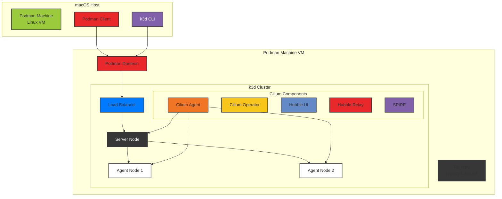

# k3d with Podman and Cilium CNI

A guide for running k3d clusters with Cilium CNI using Podman as the container runtime.

## Overview

This document covers the Cilium-specific configuration and setup for k3d clusters. Cilium is an eBPF-based networking, observability, and security solution for Kubernetes.


## Architecture



## Key Features

- 🚀 eBPF-native networking and security
- 🔍 Deep observability with Hubble
- 🔒 Transparent encryption with WireGuard
- 🔐 mTLS with SPIRE integration
- 🌐 Advanced load balancing with eBPF
- 📊 Real-time network flow visibility

## Quick Start

```bash
# Create cluster with Cilium config
make create-cluster K3D_CONFIG=k3d-cilium-config.yaml CLUSTER_NAME=cilium

# Patch nodes for BPF/cgroup support
make patch-nodes

# Install Prometheus CRDs (for ServiceMonitor support)
make install-prometheus-crds

# Install Cilium
make install-cilium

# Verify installation
cilium status --wait

# Run connectivity tests
cilium connectivity test

# Access Hubble UI
cilium hubble ui
```

## Configuration

### k3d Configuration (`k3d-cilium-config.yaml`)

```yaml
apiVersion: k3d.io/v1alpha5
kind: Simple
metadata:
  name: uds
servers: 1                      # Control plane nodes
agents: 2                       # Worker nodes
image: rancher/k3s:v1.33.1-k3s1 # k3s version
subnet: "172.28.0.0/16"         # Cluster subnet
ports:
  - port: 8080:80               # Expose port 80 as 8080
    nodeFilters:
      - loadbalancer
options:
  k3s:
    extraArgs:
      # Disable default CNI for Cilium
      - arg: --disable-network-policy
        nodeFilters:
          - server:*
      - arg: --flannel-backend=none
        nodeFilters:
          - server:*
      - arg: --disable=traefik
        nodeFilters:
          - server:*
registries:
  mirrors:
    registry1.dso.mil:
      endpoint:
        - http://registry1.dso.mil
  configs:
    registry1.dso.mil:
      auth:
        username: <username>
        password: <password>
```

### Cilium Values (`cilium-values.yml`)

```yaml
# BPF Configuration
bpf:
  masquerade: true              # Enable BPF masquerading

# Cluster Identity
cluster:
  name: k3d-uds
  id: 99                        # Unique cluster ID

# Networking
kubeProxyReplacement: true      # Replace kube-proxy with eBPF

# Observability
hubble:
  enabled: true
  metrics:
    enabled:
      - dns:query;ignoreAAAA
      - drop
      - tcp
      - flow
      - icmp
      - http
    dashboards:
      enabled: true
    serviceMonitor:
      enabled: true  # Requires Prometheus CRDs
  relay:
    enabled: true
  ui:
    enabled: true

# Ingress
ingressController:
  enabled: true
  default: true

# Security
authentication:
  mutual:
    spire:
      enabled: true
      install:
        enabled: true

# Encryption
encryption:
  enabled: true
  type: wireguard
  nodeEncryption: true
```

## Verification

```bash
# Check Cilium status
cilium status --wait

# Run connectivity tests
cilium connectivity test

# Access Hubble UI
cilium hubble ui

# Check cluster nodes
kubectl get nodes

# Verify Cilium pods
kubectl get pods -n kube-system | grep cilium
```

## Troubleshooting

### BPF Mount Failures

**Problem**: BPF filesystem not mounting

```bash
Error: failed to mount BPF filesystem
```

**Solution**:

```bash
# Verify mounts on nodes
for node in $(kubectl get nodes -o jsonpath='{.items[*].metadata.name}'); do
    echo "=== Node: $node ==="
    docker exec $node mount | grep bpf
    docker exec $node mount | grep cgroup
done

# Remount if needed
make patch-nodes
```

### Cilium Installation Failures

**Problem**: Cilium pods not starting

```bash
cilium-agent CrashLoopBackOff
```

**Solution**:

```bash
# Check logs
kubectl logs -n kube-system -l app.kubernetes.io/name=cilium-agent

# Verify kernel requirements
kubectl exec -n kube-system ds/cilium -- cilium-health status

# Reinstall with debug
cilium uninstall
cilium install -f cilium-values.yml --debug
```

## Advanced Features

### Custom Network Policies

```yaml
apiVersion: cilium.io/v2
kind: CiliumNetworkPolicy
metadata:
  name: allow-frontend-to-backend
spec:
  endpointSelector:
    matchLabels:
      app: backend
  ingress:
    - fromEndpoints:
        - matchLabels:
            app: frontend
      toPorts:
        - ports:
            - port: "8080"
              protocol: TCP
```

### Enabling Additional Features

#### Gateway API Support

```bash
cilium install --set gatewayAPI.enabled=true
```

#### Service Mesh (Beta)

```bash
cilium install --set serviceProxy.enabled=true
```

#### BGP Control Plane

```bash
cilium install --set bgpControlPlane.enabled=true
```

### Performance Tuning

```yaml
# High-performance settings
cilium:
  config:
    bpf-map-dynamic-size-ratio: "0.005"
    bpf-policy-map-max: "65536"
    bpf-lb-map-max: "65536"
    preallocate-bpf-maps: "true"
```

### Multi-cluster Setup

```bash
# Create additional clusters
k3d cluster create cluster2 --config k3d-cluster2.yaml

# Install Cilium Cluster Mesh
cilium clustermesh enable --context k3d-cilium
cilium clustermesh enable --context k3d-cluster2
cilium clustermesh connect --context k3d-cilium --destination-context k3d-cluster2
```

## Debug Commands

```bash
# Cluster status
k3d cluster list
kubectl cluster-info

# Node status
kubectl get nodes -o wide
kubectl describe nodes

# Cilium status
cilium status
cilium config view
kubectl -n kube-system exec ds/cilium -- cilium monitor

# Hubble status
hubble status
hubble observe

# Cilium network policies
kubectl get cnp -A
kubectl get ccnp
```

## Resources

- [Cilium Official Site](https://cilium.io/)
- [Cilium Documentation](https://docs.cilium.io/en/stable/)
- [Hubble Documentation](https://docs.cilium.io/en/stable/gettingstarted/hubble/)
- [eBPF Official Site](https://ebpf.io/)