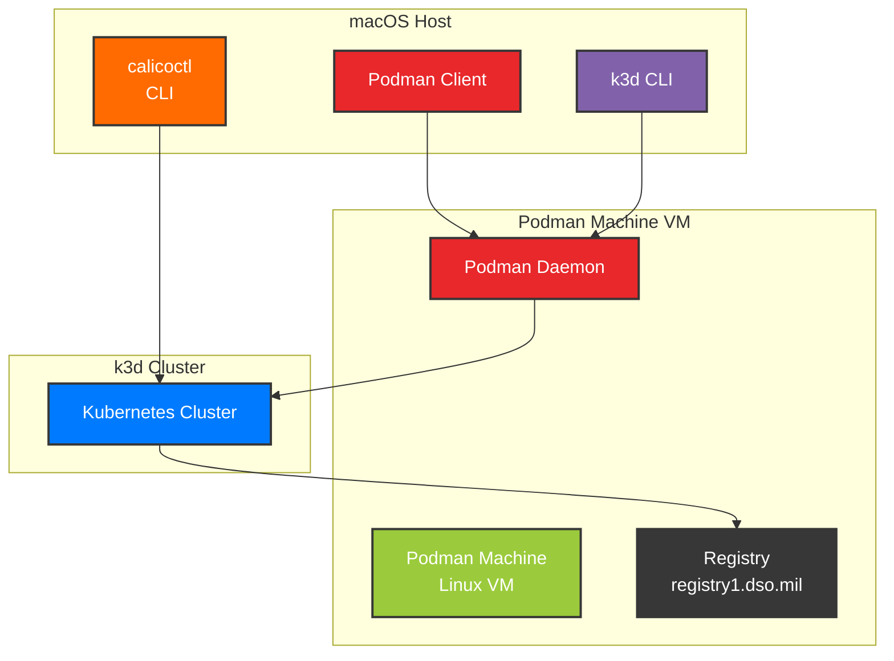
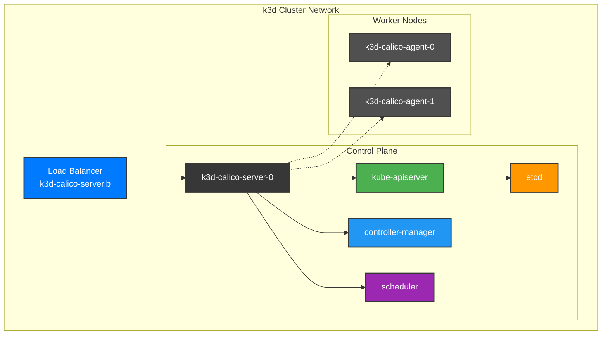
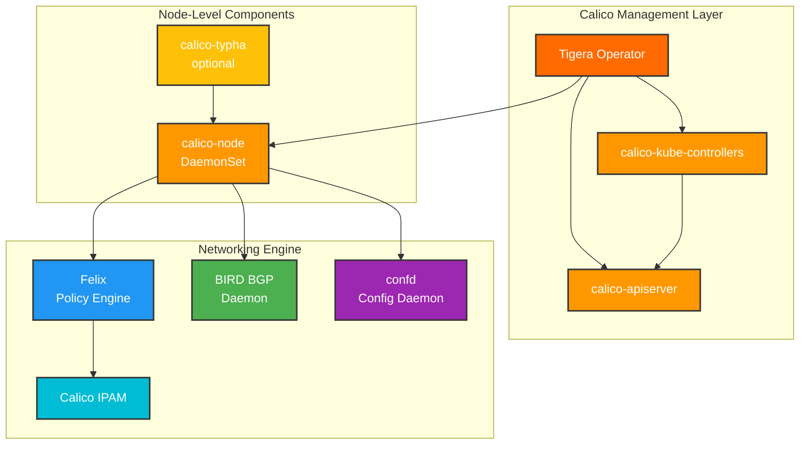
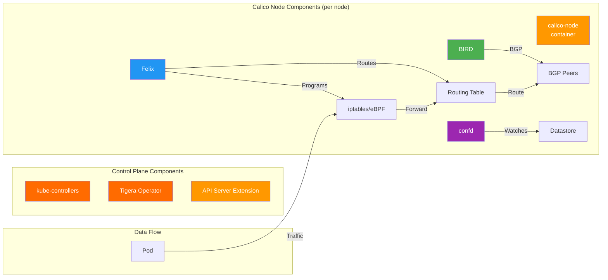

# k3d with Docker/Podman and Calico CNI

A comprehensive guide for running k3d (Kubernetes in Docker) clusters using Docker or Podman as the container runtime with Calico CNI for advanced networking, security, and network policy management.

> **Note**: For Cilium CNI setup, please refer to [README-CILIUM.md](README-CILIUM.md)

## Table of Contents

- [Overview](#overview)
- [Prerequisites](#prerequisites)
- [Understanding eBPF](#understanding-ebpf)
- [Architecture](#architecture)
- [Quick Start](#quick-start)
- [Detailed Setup Guide](#detailed-setup-guide)
- [Configuration Reference](#configuration-reference)
- [Troubleshooting](#troubleshooting)
- [Advanced Topics](#advanced-topics)

## Overview

This project demonstrates how to run k3d clusters with:

- **Docker** or **Podman** as the container runtime
- **Calico CNI** for advanced networking with optional eBPF dataplane
- **Network Policies**: Full Kubernetes NetworkPolicy support plus Calico-specific policies
- **BGP Support**: Advanced routing capabilities for on-premise and hybrid cloud
- **Flexible IPAM**: Multiple IP pools and advanced IP management
- **Multiple Dataplanes**: Choose between standard (iptables) or high-performance eBPF
- **Production-ready** configuration with enterprise features

## Calico CNI

<p align="center">
  
</p>

Calico is a cloud-native networking and network security solution for containers, virtual machines, and native host-based workloads. It supports multiple data planes including Linux eBPF, standard iptables, and VPP.

### Key Features

- 🚀 Lightweight Kubernetes development environment
- 🐅 Calico CNI with flexible dataplane options (iptables or eBPF)
- 🔒 Enhanced security with fine-grained network policies
- 🌐 BGP support for advanced routing scenarios
- 🎯 Multiple IP pools for workload isolation
- 📊 Prometheus metrics and observability
- 📦 Registry integration for private images
- 🔧 Production-like development environment

## Prerequisites

### Software Requirements

| Component | Version | Purpose |
|-----------|---------|---------|
| Docker/Podman | Latest/5.5.1+ | Container runtime |
| k3d | v5.8.3+ | Kubernetes cluster management |
| k3s | v1.31.5+ | Lightweight Kubernetes |
| kubectl | Latest | Kubernetes CLI |
| Helm | 3.x | Package management |
| just | Latest | Command runner (replaces make) |
| sops | Latest | Secrets encryption (optional) |
| envsubst | Latest | Environment variable substitution |
| calicoctl | v3.30.1+ | Calico management (optional) |

### System Requirements

- **OS**: macOS (Intel/Apple Silicon) or Linux
- **Memory**: 16GB RAM recommended
- **CPU**: 4+ cores recommended
- **Disk**: 50GB+ available space
- **Kernel**: Linux kernel 5.4+ (for Cilium)

## Understanding eBPF

<p align="center">
  
</p>

### What is eBPF?

[eBPF (extended Berkeley Packet Filter)](https://ebpf.io/) is a revolutionary technology that enables programmable kernel-level functionality without modifying kernel source code or loading kernel modules. Both Cilium and Calico leverage eBPF to provide high-performance, secure networking.

### Key Benefits of eBPF

- **Performance**: Run networking logic in kernel space for minimal overhead
- **Security**: Implement fine-grained security policies at the kernel level
- **Observability**: Deep visibility into network traffic and system behavior
- **Flexibility**: Dynamically update networking behavior without restarts

### How CNIs Use eBPF

#### Cilium

- **Native eBPF**: Built from the ground up on eBPF
- **kube-proxy replacement**: Full eBPF-based load balancing
- **Network policies**: Enforced in kernel with eBPF programs
- **Visibility**: Hubble leverages eBPF for deep observability

#### Calico

- **eBPF dataplane**: Optional high-performance mode
- **XDP support**: eXpress Data Path for fast packet processing
- **Policy enforcement**: eBPF programs for efficient rule matching
- **Hybrid mode**: Can run with or without eBPF

### Learn More

- [eBPF Official Website](https://ebpf.io/)
- [eBPF Summit Videos](https://ebpf.io/summit-2024/)
- [Cilium eBPF Documentation](https://docs.calico.io/en/stable/bpf/)
- [Calico eBPF Documentation](https://docs.tigera.io/calico/latest/operations/ebpf/)

## Architecture

### Architecture Overview

The Calico architecture consists of three main layers: the host infrastructure, the Kubernetes cluster topology, and the Calico networking components. Each diagram below focuses on a specific aspect for better clarity.

#### 1. Host and Infrastructure Layer



#### 2. k3d Cluster Topology



#### 3. Calico Components Architecture



### Calico Component Details



## Quick Start

### Using Docker (Recommended for macOS)

```bash
# 1. Clone the repository
git clone https://github.com/mkm29/k3d-calico
cd k3d-calico

# 2. Ensure Docker is running
docker version

# 3. (Optional) Set up encrypted registry credentials
# Create .secrets.enc.env with encrypted credentials
sops -e -i .secrets.enc.env

# 4. (Optional) Configure via cluster.env file
echo "CLUSTER_NAME=uds-dev" > cluster.env
echo "CNI_TYPE=calico" >> cluster.env

# 5. Create cluster with Calico (default)
just setup-calico

# 6. Verify installation
kubectl get pods -n calico-system
kubectl get pods -n tigera-operator

# 7. (Optional) Enable eBPF dataplane
just enable-calico-ebpf
```

### Using Podman (Linux or experimental macOS)

```bash
# 1. Clone the repository
git clone https://github.com/mkm29/k3d-calico
cd k3d-calico

# 2. Initialize Podman machine (macOS only)
podman machine init --cpus 16 --memory 16384 --disk-size 100

# 3. Configure SSH (required for k3d with Podman)
cat >> ~/.ssh/config <<EOF
Host localhost 127.0.0.1
    IdentityFile ~/.local/share/containers/podman/machine/machine
    StrictHostKeyChecking no
EOF

# 4. (Optional) Set up encrypted registry credentials
# Create .secrets.enc.env with encrypted credentials
sops -e -i .secrets.enc.env

# 5. (Optional) Configure via cluster.env file
echo "CLUSTER_NAME=uds-dev" > cluster.env
echo "CNI_TYPE=calico" >> cluster.env

# 6. Create cluster with Calico (default)
just setup-calico

# 7. Verify installation
kubectl get pods -n calico-system
kubectl get pods -n tigera-operator

# 8. (Optional) Enable eBPF dataplane
just enable-calico-ebpf
```

## Detailed Setup Guide

### Step 0: Prerequisites Installation

#### Install just (Command Runner)

```bash
# macOS
brew install just

# Linux
cargo install just
# or
wget -qO - 'https://proget.makedeb.org/debian-feeds/prebuilt-mpr/pool/just_1.14.0_amd64/just_1.14.0_amd64.deb' | sudo dpkg -i -
```

#### Install SOPS (Optional - for encrypted secrets)

```bash
# macOS
brew install sops

# Linux
wget https://github.com/mozilla/sops/releases/download/v3.10.2/sops-v3.10.2.linux.amd64
sudo mv sops-v3.10.2.linux.amd64 /usr/local/bin/sops
sudo chmod +x /usr/local/bin/sops
```

#### Install envsubst (Usually included with gettext)

```bash
# macOS
brew install gettext

# Linux (usually pre-installed)
sudo apt-get install gettext-base  # Ubuntu/Debian
sudo yum install gettext           # CentOS/RHEL
```

### Step 1: Container Runtime Installation and Configuration

> **⚠️ Important Note for macOS Users (especially Apple Silicon)**
> 
> Rootless Podman on macOS may not work reliably with k3d, even when following the [official k3d Podman instructions](https://k3d.io/v5.8.3/usage/advanced/podman/#macos). Common issues include:
> - SSH connection problems
> - Container networking failures
> - Permission issues with volume mounts
> 
> **Recommendation**: Use Docker Desktop on macOS for the most reliable experience. The instructions below include both Docker and Podman setup, but Docker is strongly recommended for macOS users.

#### macOS Setup - Docker (Recommended)

```bash
# Install Docker Desktop
brew install --cask docker

# Start Docker Desktop from Applications
# Ensure Docker is running:
docker version

# No additional configuration needed for k3d
```

#### macOS Setup - Podman (Experimental, may not work)

```bash
# Install Podman
brew install podman

# Initialize Podman machine with adequate resources
podman machine init podman-machine-default \
    --cpus 16 \
    --memory 16384 \
    --disk-size 100 \
    --now

# Install system helper for Docker API compatibility
sudo /opt/homebrew/Cellar/podman/5.5.1/bin/podman-mac-helper install
podman machine stop
podman machine start

# Configure cgroup delegation (required for k3d)
podman machine ssh bash -e <<EOF
  printf '[Service]\nDelegate=cpuset\n' | sudo tee /etc/systemd/system/user@.service.d/k3d.conf
  sudo systemctl daemon-reload
  sudo systemctl restart "user@\${UID}"
EOF
```

#### Linux Setup - Docker

```bash
# Install Docker (Ubuntu/Debian)
sudo apt-get update
sudo apt-get install -y docker.io

# Add user to docker group
sudo usermod -aG docker $USER
newgrp docker

# Enable Docker
sudo systemctl enable --now docker
```

#### Linux Setup - Podman

```bash
# Install Podman (Ubuntu/Debian)
sudo apt-get update
sudo apt-get install -y podman

# Enable Podman socket
sudo systemctl enable --now podman.socket

# For rootless mode
systemctl --user enable --now podman.socket
```

### Step 2: Environment Configuration

#### For Docker

```bash
# No additional configuration needed
# Docker is the default for k3d
```

#### For Podman

```bash
# Get connection details
podman system connection ls

# Set environment variables (adjust port based on output above)
export DOCKER_HOST=ssh://core@localhost:58102
export DOCKER_SOCKET=/run/user/501/podman/podman.sock

# Create custom network (required for DNS)
podman network create k3d-podman
```

### Step 2.1: Registry Configuration (Optional)

If you need to access private registries, set up encrypted credentials:

```bash
# Set up SOPS age key (first time only)
mkdir -p ~/.config/sops/age
age-keygen -o ~/.config/sops/age/keys.txt

# Create encrypted secrets file
cat > .secrets.enc.env <<EOF
DOCKER_HUB_USERNAME=your_username
DOCKER_HUB_PASSWORD=your_password
IRONBANK_USERNAME=your_ironbank_username
IRONBANK_PASSWORD=your_ironbank_password
EOF

# Encrypt the file
sops -e -i .secrets.enc.env

# The justfile will automatically decrypt and use these credentials
```

### Step 3: SSH Configuration (Podman only)

> **Note**: This step is only required if you're using Podman. Docker users can skip to Step 4.

Update `~/.ssh/config`:

```ssh
Host localhost
    IdentityFile ~/.local/share/containers/podman/machine/machine
    StrictHostKeyChecking no

Host 127.0.0.1
    IdentityFile ~/.local/share/containers/podman/machine/machine
    StrictHostKeyChecking no
```

### Step 4: Cluster Creation

Using just:

```bash
# Run preflight checks
just preflight

# Quick setup (recommended) - creates cluster and installs Calico
# This automatically handles SOPS decryption and registry configuration
just setup-calico

# Or step by step:
just create-cluster  # Automatically processes encrypted secrets
just install-calico
```

**Note**: The `create-cluster` command now automatically:
- Decrypts `.secrets.enc.env` (if present)
- Processes `registries.yaml` with environment variable substitution
- Configures k3d with the processed registry configuration
- Cleans up temporary files after cluster creation

**Note about Calico installation**: The installation process now:

- Uses Calico v3.30.0
- Uses `kubectl create` instead of `kubectl apply` for initial resource creation
- Waits for all Tigera status conditions to be available
- Automatically enables container IP forwarding by patching the installation with `containerIPForwarding: "Enabled"`
- No longer requires waiting for individual deployments

##### Enabling eBPF Dataplane (Optional)

Calico supports an eBPF dataplane for improved performance and reduced CPU usage. To enable it:

```bash
# Enable eBPF dataplane (requires kernel 5.3+)
just enable-calico-ebpf

# To revert back to iptables dataplane
just disable-calico-ebpf
```

**eBPF Requirements**:

- Linux kernel v5.3+ (v5.8+ recommended)
- x86-64 or arm64 architecture
- Cannot mix eBPF and standard dataplane nodes
- VXLAN is used instead of IPIP for tunneling

#### Custom Configuration

The k3d configuration file is automatically determined based on the `CNI_TYPE` variable:

```bash
# Option 1: Use environment variables
CLUSTER_NAME=my-cluster CNI_TYPE=calico just create-cluster

# Option 2: Create a cluster.env file
echo "CLUSTER_NAME=my-cluster" > cluster.env
echo "CNI_TYPE=calico" >> cluster.env
just create-cluster

# Option 3: Export variables in your shell
export CLUSTER_NAME=my-cluster
export CNI_TYPE=calico
just create-cluster
```

The configuration file will be loaded from `infrastructure/k3d/config/${CNI_TYPE}.yaml`.

### Step 5: Verification

```bash
# Check Calico pods
kubectl get pods -n calico-system
kubectl get pods -n tigera-operator

# Check nodes
kubectl get nodes -o wide

# Verify Calico is running
kubectl get felixconfiguration -o yaml

# Check IP pools
kubectl get ippools -o wide

# Check node status with calicoctl (if installed)
kubectl exec -n calico-system calico-node-xxxxx -- calicoctl node status
```

### Step 6: Installing calicoctl (Optional for Calico)

The `calicoctl` command line tool provides additional management capabilities for Calico:

```bash
# macOS
curl -L https://github.com/projectcalico/calico/releases/download/v3.30.1/calicoctl-darwin-amd64 -o calicoctl
chmod +x calicoctl
sudo mv calicoctl /usr/local/bin/

# Linux
curl -L https://github.com/projectcalico/calico/releases/download/v3.30.1/calicoctl-linux-amd64 -o calicoctl
chmod +x calicoctl
sudo mv calicoctl /usr/local/bin/

# Configure calicoctl
export DATASTORE_TYPE=kubernetes
export KUBECONFIG=~/.kube/config

# Verify installation
calicoctl version
```

## Configuration Reference

### Just Configuration

The justfile includes several settings that affect command execution:

- **Shell**: Uses `zsh` with `-c` flag for compatibility
- **Export**: All just variables are automatically exported as environment variables
- **Ignore Comments**: Comments in environment files are ignored
- **Quiet Mode**: Suppresses just's command echoing for cleaner output (use `just --verbose` to see commands)
- **Dotenv Loading**: Automatically loads `cluster.env` files if present in the current directory
- **SOPS Integration**: Automatically handles encrypted `.secrets.enc.env` files

#### Environment Variables

You can configure the following variables via environment or `cluster.env` file:

- `CLUSTER_NAME`: k3d cluster name (default: "uds-dev")
- `CNI_TYPE`: Type of CNI to use (default: "calico"), determines which config file to use

Example `cluster.env` file:
```bash
# Create cluster.env file
CLUSTER_NAME=my-cluster
CNI_TYPE=calico  # Will use infrastructure/k3d/config/calico.yaml
```

The k3d configuration file is automatically selected as `infrastructure/k3d/config/${CNI_TYPE}.yaml`.

#### Registry Credentials (Optional)

For private registry access, create an encrypted `.secrets.enc.env` file:

```bash
# Create and encrypt secrets
cat > .secrets.enc.env <<EOF
DOCKER_HUB_USERNAME=your_username
DOCKER_HUB_PASSWORD=your_password
IRONBANK_USERNAME=your_ironbank_username
IRONBANK_PASSWORD=your_ironbank_password
EOF

# Encrypt the file
sops -e -i .secrets.enc.env
```

### Just Recipes

| Recipe | Description | Dependencies | Variables |
|--------|-------------|--------------|-----------|
| `default` | Show available commands | - | - |
| `preflight` | Check required tools | - | - |
| `decrypt-sops` | Decrypt SOPS environment file | - | - |
| `process-registries` | Process registries.yaml with env vars | decrypt-sops | - |
| `cleanup-temp` | Clean up temporary files | - | - |
| `create-cluster` | Create k3d cluster | preflight, decrypt-sops, process-registries | `CNI_TYPE`, `CLUSTER_NAME` |
| `install-prometheus-crds` | Install Prometheus CRDs | - | - |
| `install-gateway-api` | Install Gateway API CRDs | - | - |
| `install-calico` | Install Calico CNI | - | - |
| `enable-calico-ebpf` | Enable eBPF dataplane for Calico | - | - |
| `disable-calico-ebpf` | Disable eBPF dataplane (revert to iptables) | - | - |
| `uninstall-calico` | Remove Calico | - | - |
| `delete-cluster` | Delete k3d cluster | cleanup-temp | `CLUSTER_NAME` |
| `setup-calico` | Complete Cilium setup | - | `CNI_TYPE`, `CLUSTER_NAME` |
| `setup-calico` | Complete Calico setup | - | `CNI_TYPE`, `CLUSTER_NAME` |
| `setup-calico-ebpf` | Calico with eBPF setup | - | `CNI_TYPE`, `CLUSTER_NAME` |
| `status` | Show cluster status | - | `CLUSTER_NAME` |
| `test-connectivity` | Test network connectivity | - | - |

### k3d Configuration

#### Calico Configuration (`k3d-calico-config.yaml`)

```yaml
apiVersion: k3d.io/v1alpha5
kind: Simple
metadata:
  name: calico
servers: 1                      # Control plane nodes
agents: 2                       # Worker nodes
image: rancher/k3s:v1.33.1-k3s1 # k3s version
subnet: "172.28.0.0/16"         # Cluster subnet
ports:
  - port: 8080:80               # Expose port 80 as 8080
    nodeFilters:
      - loadbalancer
  # - port: 6443:6443           # API server port (commented out)
  #   nodeFilters:
  #     - loadbalancer
options:
  k3s:
    extraArgs:
      # Disable default CNI for Calico
      - arg: --flannel-backend=none
        nodeFilters:
          - server:*
      - arg: --disable-network-policy
        nodeFilters:
          - server:*
      # Calico specific settings (commented out since subnet is specified at k3d level)
      # - arg: --cluster-cidr="172.28.0.0/16"
      #   nodeFilters:
      #     - server:*
      # - arg: --service-cidr=10.96.0.0/12
      #   nodeFilters:
      #     - server:*
      - arg: --disable=traefik
        nodeFilters:
          - server:*
```

### Calico Configuration

The default Calico installation provides:

- **IPAM**: Calico's IP Address Management
- **Network Policy**: Full Kubernetes NetworkPolicy support plus Calico-specific policies
- **Data Store**: Kubernetes API server (no etcd required)
- **Pod Network CIDR**: Uses k3d's subnet configuration (172.28.0.0/16)
- **Service CIDR**: Default Kubernetes service CIDR (10.96.0.0/12)
- **Container IP Forwarding**: Enabled by default for proper pod-to-pod communication
- **BGP**: Optional BGP routing for advanced networking scenarios
- **Multiple Dataplane Options**:
  - **Standard (iptables)**: Default Linux dataplane using iptables/ipsets
  - **eBPF**: High-performance dataplane using eBPF programs
  - **VPP**: Vector Packet Processing for extreme performance (experimental)

**Note**: The cluster CIDR and service CIDR are no longer explicitly set in the k3s arguments since we're using k3d's `subnet` configuration at the cluster level. This ensures consistency across the cluster configuration.

## Troubleshooting

### Common Issues

#### 1. Container Runtime Connection Issues

**Problem**: k3d cannot connect to the container runtime

```bash
Error: Cannot connect to the Docker daemon
```

**Solution for Docker**:

```bash
# Ensure Docker Desktop is running (macOS)
# Check Docker icon in menu bar or open Docker Desktop app

# Verify Docker is running
docker version

# If on Linux, check Docker service
sudo systemctl status docker
sudo systemctl start docker
```

**Solution for Podman**:

```bash
# Verify Podman is running
podman machine list
podman machine start

# Check environment variables (Podman only)
echo $DOCKER_HOST
echo $DOCKER_SOCKET

# Test connection
docker version
```

> **macOS Note**: If using Podman on macOS and experiencing persistent issues, consider switching to Docker Desktop for better compatibility.

#### 2. DNS Resolution Issues

**Problem**: Pods cannot resolve DNS

```bash
nslookup: can't resolve 'kubernetes.default'
```

**Solution**:

```bash
# Check CoreDNS
kubectl get pods -n kube-system -l k8s-app=kube-dns

# For Cilium - Verify DNS proxy
kubectl exec -n kube-system ds/calico -- calico config view | grep dns

# For Calico - Check DNS configuration
kubectl get endpoints -n kube-system kube-dns

# Test DNS
kubectl run test-dns --image=busybox:1.28 --rm -it -- nslookup kubernetes.default
```

#### 3. Calico-Specific Issues

**Problem**: Calico pods stuck in Init or CrashLoopBackOff

```bash
Error: calico-node pods not ready
```

**Solution**:

```bash
# Check logs
kubectl logs -n calico-system -l k8s-app=calico-node

# Verify operator logs
kubectl logs -n tigera-operator deployment/tigera-operator

# Check node configuration
kubectl get nodes -o yaml | grep -A5 "podCIDR"
```

**Problem**: Pods cannot communicate across nodes (Calico)

```bash
# Test connectivity
kubectl run test-pod --image=busybox --rm -it -- sh
/ # ping <pod-ip-on-different-node>
```

**Solution**:

```bash
# Check Calico node status
kubectl get pods -n calico-system -o wide

# Verify BGP peers (if using BGP)
kubectl exec -n calico-system calico-node-xxxxx -- calicoctl node status

# Check IP pools
kubectl get ippools -o yaml

# Verify IPIP tunnel status
kubectl exec -n calico-system ds/calico-node -- ip tunnel show

# Check routing table
kubectl exec -n calico-system ds/calico-node -- ip route

# Verify iptables rules
kubectl exec -n calico-system ds/calico-node -- iptables-save | grep -i calico
```

**Problem**: Calico eBPF mode issues

```bash
Error: BPF dataplane not working correctly
```

**Solution**:

```bash
# Verify eBPF is enabled
kubectl get felixconfiguration default -o yaml | grep bpfEnabled

# Check BPF maps
kubectl exec -n calico-system ds/calico-node -- bpftool map list

# Verify BPF programs are loaded
kubectl exec -n calico-system ds/calico-node -- bpftool prog list

# Check for BPF-related errors
kubectl logs -n calico-system -l k8s-app=calico-node | grep -i bpf

# Ensure kernel has BPF support
kubectl exec -n calico-system ds/calico-node -- grep CONFIG_BPF /boot/config-$(uname -r)
```

#### 4. k3d Configuration Issues

**Problem**: Invalid CIDR address error when creating cluster

```bash
Error: invalid cluster-cidr "10.42.0.0/16": invalid CIDR address: "10.42.0.0/16"
```

**Solution**:

This error occurs when smart quotes are used in the k3d configuration file instead of regular quotes.

```bash
# Check for smart quotes in your config
cat infrastructure/k3d/calico-config.yaml | grep cluster-cidr

# Fix by removing quotes from CIDR values
# Bad:  - arg: --cluster-cidr="10.42.0.0/16"
# Good: - arg: --cluster-cidr=10.42.0.0/16
```

#### 5. Connectivity Test Issues

**Problem**: Connectivity test fails on first run with "Operation not permitted"

```bash
wget: can't connect to remote host (10.x.x.x): Operation not permitted
```

**Solution**:

This is a race condition where the CNI hasn't fully configured network policies before the test runs.

```bash
# The justfile now includes a 5-second delay to allow CNI setup
# If you still experience issues, increase the delay or check CNI status:

# For Calico
kubectl get pods -n calico-system -o wide
kubectl logs -n calico-system -l k8s-app=calico-node | tail -50

# For Cilium
kubectl get pods -n kube-system -l k8s-app=calico
calico status
```

### Debug Commands

```bash
# Cluster status
k3d cluster list
kubectl cluster-info

# Node status
kubectl get nodes -o wide
kubectl describe nodes

# Calico status
kubectl get pods -n calico-system
kubectl get pods -n tigera-operator

# Calico specific resources
kubectl get felixconfigurations
kubectl get ippools
kubectl get ipamblocks
kubectl get networkpolicies -A

# Calico network policies
kubectl get networkpolicies.projectcalico.org -A
kubectl get globalnetworkpolicies

# Using calicoctl from inside a pod (if calicoctl not installed locally)
kubectl exec -n calico-system deployment/calico-kube-controllers -- calicoctl get nodes
kubectl exec -n calico-system deployment/calico-kube-controllers -- calicoctl get ippools
kubectl exec -n calico-system deployment/calico-kube-controllers -- calicoctl get workloadendpoints

# Check Calico node connectivity
kubectl exec -n calico-system ds/calico-node -- calicoctl node status
kubectl exec -n calico-system ds/calico-node -- calicoctl get bgppeers

# Debug Calico dataplane
kubectl exec -n calico-system ds/calico-node -- calico-node -felix-live -felix-ready

# View Calico logs
kubectl logs -n calico-system -l k8s-app=calico-node --tail=100
kubectl logs -n tigera-operator deployment/tigera-operator --tail=100
```

## Advanced Topics

### Custom Network Policies

#### Calico Network Policy

```yaml
apiVersion: projectcalico.org/v3
kind: NetworkPolicy
metadata:
  name: allow-nginx-ingress
  namespace: default
spec:
  selector: app == "nginx"
  types:
  - Ingress
  ingress:
  - action: Allow
    protocol: TCP
    source:
      selector: app == "client"
    destination:
      ports:
      - 80
```

#### Calico Global Network Policy

Global policies apply across all namespaces:

```yaml
apiVersion: projectcalico.org/v3
kind: GlobalNetworkPolicy
metadata:
  name: deny-egress-to-private
spec:
  selector: all()
  types:
  - Egress
  egress:
  - action: Deny
    protocol: TCP
    destination:
      nets:
      - 10.0.0.0/8
      - 172.16.0.0/12
      - 172.28.0.0/16
  - action: Allow  # Allow everything else
```

### Enabling Additional Features

#### Gateway API Support

```bash
just install-gateway-api
```

### Performance Tuning

#### Calico Performance Tuning

```bash
# Adjust Felix configuration
kubectl patch felixconfiguration default --type='merge' -p '{"spec":{"prometheusMetricsEnabled":true}}'

# Enable fast datapath (eBPF)
kubectl patch felixconfiguration default --type='merge' -p '{"spec":{"bpfEnabled":true}}'

# Advanced Felix tuning for high-performance environments
cat <<EOF | kubectl apply -f -
apiVersion: projectcalico.org/v3
kind: FelixConfiguration
metadata:
  name: default
spec:
  bpfEnabled: true
  bpfDataIfacePattern: "^(eth|ens|enp|wl)"
  bpfLogLevel: "Info"
  floatingIPs: Enabled
  logSeverityScreen: Info
  prometheusMetricsEnabled: true
  prometheusMetricsPort: 9091
  ipipEnabled: true
  vxlanEnabled: false
  wireguardEnabled: false
  failsafeInboundHostPorts:
  - protocol: tcp
    port: 22
  - protocol: tcp
    port: 443
  - protocol: tcp
    port: 6443
  failsafeOutboundHostPorts:
  - protocol: tcp
    port: 443
  - protocol: udp
    port: 53
  - protocol: tcp
    port: 53
EOF

# Configure Calico for high connection environments
kubectl patch felixconfiguration default --type='merge' -p '{
  "spec": {
    "conntrackMaxPerCore": 131072,
    "natPortRange": "32768:65535",
    "natOutgoingInterfaceFilter": "eth0"
  }
}'

# Enable BPF connection-time load balancing
kubectl patch felixconfiguration default --type='merge' -p '{
  "spec": {
    "bpfConnectTimeLoadBalancingEnabled": true,
    "bpfExternalServiceMode": "DSR"
  }
}'
```

#### Switching Calico Dataplane Modes

You can switch between different Calico dataplane modes using the just recipes:

```bash
# Enable eBPF dataplane (recommended approach)
just enable-calico-ebpf

# Disable eBPF and revert to iptables
just disable-calico-ebpf
```

Or manually using kubectl:

```bash
# Switch to eBPF dataplane (requires kernel 5.3+)
kubectl patch installation.operator.tigera.io default --type merge -p '{"spec":{"calicoNetwork":{"linuxDataplane":"BPF"}}}'

# Verify eBPF mode is active
kubectl logs -n calico-system -l k8s-app=calico-node | grep -i "BPF dataplane is in use"

# Switch back to standard iptables dataplane
kubectl patch installation.operator.tigera.io default --type merge -p '{"spec":{"calicoNetwork":{"linuxDataplane":"Iptables"}}}'

# Configure eBPF with specific settings via FelixConfiguration
cat <<EOF | kubectl apply -f -
apiVersion: projectcalico.org/v3
kind: FelixConfiguration
metadata:
  name: default
spec:
  bpfKubeProxyIptablesCleanupEnabled: true
  bpfKubeProxyMinSyncPeriod: 1s
  bpfExtToServiceConnmark: 0x80000000
  bpfDataIfacePattern: "^(eth|ens|enp|wl)"
  bpfLogLevel: "Info"
EOF
```

**Note**: When using the operator installation method (which we use), the eBPF mode is controlled via the Installation resource, not the FelixConfiguration.

### Calico-Specific Advanced Features

#### BGP Configuration

Enable BGP for advanced routing scenarios:

```yaml
apiVersion: projectcalico.org/v3
kind: BGPConfiguration
metadata:
  name: default
spec:
  logSeverityScreen: Info
  nodeToNodeMeshEnabled: true
  asNumber: 64512
  serviceClusterIPs:
  - cidr: 10.96.0.0/12
  serviceExternalIPs:
  - cidr: 10.100.0.0/16
```

Configure BGP peers:

```yaml
apiVersion: projectcalico.org/v3
kind: BGPPeer
metadata:
  name: external-router
spec:
  peerIP: 172.16.1.1
  asNumber: 64513
  nodeSelector: "!all()"  # Apply to specific nodes
```

Per-node BGP configuration:

```yaml
apiVersion: projectcalico.org/v3
kind: Node
metadata:
  name: k3d-calico-server-0
spec:
  bgp:
    ipv4Address: 172.28.0.2/16
    ipv4IPIPTunnelAddr: 192.168.255.1
```

#### IP Pool Management

Create custom IP pools for different workloads:

```yaml
apiVersion: projectcalico.org/v3
kind: IPPool
metadata:
  name: production-pool
spec:
  cidr: 192.168.1.0/24
  ipipMode: Never
  natOutgoing: true
  disabled: false
  nodeSelector: environment == "production"
```

Configure IPIP tunneling modes:

```yaml
apiVersion: projectcalico.org/v3
kind: IPPool
metadata:
  name: cross-subnet-pool
spec:
  cidr: 192.168.2.0/24
  ipipMode: CrossSubnet  # Options: Always, CrossSubnet, Never
  vxlanMode: Never       # Options: Always, CrossSubnet, Never
  natOutgoing: true
  disabled: false
```

Example: Creating separate IP pools for different namespaces:

```bash
# Create a pool for development namespace
cat <<EOF | kubectl apply -f -
apiVersion: projectcalico.org/v3
kind: IPPool
metadata:
  name: dev-pool
spec:
  cidr: 192.168.10.0/24
  ipipMode: Never
  natOutgoing: true
  disabled: false
  nodeSelector: environment == "development"
EOF

# Create a pool with VXLAN for cloud environments
cat <<EOF | kubectl apply -f -
apiVersion: projectcalico.org/v3
kind: IPPool
metadata:
  name: cloud-pool
spec:
  cidr: 192.168.20.0/24
  ipipMode: Never
  vxlanMode: Always
  natOutgoing: true
  disabled: false
EOF

# Annotate namespace to use specific pool
kubectl annotate namespace development projectcalico.org/ipv4pools='["dev-pool"]'
kubectl annotate namespace cloud projectcalico.org/ipv4pools='["cloud-pool"]'
```

#### Calico Workload Endpoints

View and manage workload endpoints:

```bash
# List all workload endpoints
kubectl get workloadendpoints -A

# Get detailed workload endpoint info
kubectl get workloadendpoints -o yaml

# Using calicoctl for more details
kubectl exec -n calico-system deployment/calico-kube-controllers -- calicoctl get workloadendpoints -o wide

# Filter workload endpoints by namespace
kubectl exec -n calico-system deployment/calico-kube-controllers -- calicoctl get workloadendpoints --namespace=default
```

Create host endpoints for bare metal or VM scenarios:

```yaml
apiVersion: projectcalico.org/v3
kind: HostEndpoint
metadata:
  name: host-eth0
  labels:
    environment: production
spec:
  interfaceName: eth0
  node: k3d-calico-server-0
  expectedIPs:
  - 172.28.0.2
```

#### Calico Monitoring and Observability

Enable Prometheus metrics for Calico:

```bash
# Enable metrics in Felix
kubectl patch felixconfiguration default --type='merge' -p '{
  "spec": {
    "prometheusMetricsEnabled": true,
    "prometheusMetricsPort": 9091,
    "prometheusProcessMetricsEnabled": true
  }
}'

# Create ServiceMonitor for Prometheus Operator
cat <<EOF | kubectl apply -f -
apiVersion: monitoring.coreos.com/v1
kind: ServiceMonitor
metadata:
  name: calico-node
  namespace: calico-system
spec:
  selector:
    matchLabels:
      k8s-app: calico-node
  endpoints:
  - port: http-metrics
    interval: 30s
    path: /metrics
EOF

# Enable Typha metrics (if using Typha)
kubectl set env -n calico-system deployment/calico-typha TYPHA_PROMETHEUSMETRICSENABLED=true
kubectl set env -n calico-system deployment/calico-typha TYPHA_PROMETHEUSMETRICSPORT=9093
```

View Calico metrics:

```bash
# Port-forward to access metrics
kubectl port-forward -n calico-system ds/calico-node 9091:9091

# In another terminal, view metrics
curl http://localhost:9091/metrics | grep felix

# Key metrics to monitor:
# - felix_cluster_num_workload_endpoints
# - felix_cluster_num_hosts
# - felix_iptables_restore_calls
# - felix_ipset_calls
# - felix_route_table_list_seconds
```

### Multi-cluster Setup

For multi-cluster setups with Calico, refer to the [Calico Multi-cluster documentation](https://docs.tigera.io/calico/latest/multicluster/), which supports federation across multiple Kubernetes clusters.

## Resources

### Project Documentation

- [k3d Documentation](https://k3d.io/v5.8.3/)
- [k3s Documentation](https://docs.k3s.io/)
- [Podman Documentation](https://docs.podman.io/)

### Calico Documentation

- [Calico Official Site](https://www.tigera.io/project-calico/)
- [Calico Documentation](https://docs.tigera.io/calico/latest/about/)
- [Calico Network Policies](https://docs.tigera.io/calico/latest/network-policy/)
- [Calico BGP Documentation](https://docs.tigera.io/calico/latest/networking/bgp/)
- [Calico IP Pool Management](https://docs.tigera.io/calico/latest/networking/ipam/)
- [Calico eBPF Dataplane](https://docs.tigera.io/calico/latest/operations/ebpf/)
- [Calico Installation Guide](https://docs.tigera.io/calico/latest/getting-started/kubernetes/)

### eBPF Resources

- [eBPF Official Site](https://ebpf.io/)
- [eBPF Summit](https://ebpf.io/summit-2024/)

## Contributing

1. Fork the repository
2. Create a feature branch (`git checkout -b feature/amazing-feature`)
3. Commit your changes (`git commit -m 'Add amazing feature'`)
4. Push to the branch (`git push origin feature/amazing-feature`)
5. Open a Pull Request

## License

This project is licensed under the MIT License - see the LICENSE file for details.
