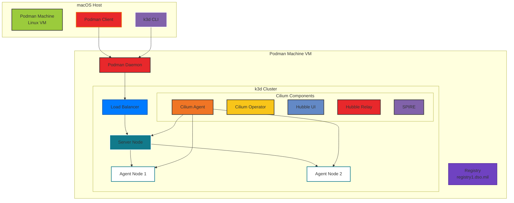

# k3d with Podman and Cilium

A comprehensive guide for running k3d (Kubernetes in Docker) clusters using Podman as the container runtime with Cilium CNI for advanced networking, security, and observability features.

## Table of Contents

- [Overview](#overview)
- [Prerequisites](#prerequisites)
- [Architecture](#architecture)
- [Quick Start](#quick-start)
- [Detailed Setup Guide](#detailed-setup-guide)
- [Configuration Reference](#configuration-reference)
- [Troubleshooting](#troubleshooting)
- [Advanced Topics](#advanced-topics)

## Overview

This project demonstrates how to run k3d clusters with:

- **Podman** as the container runtime (instead of Docker)
- **Cilium** as the CNI for advanced networking features
- **Hubble** for observability and metrics
- **WireGuard** encryption for node-to-node traffic
- **SPIRE** for mutual TLS authentication

### Key Features

- 🚀 Lightweight Kubernetes development environment
- 🔒 Enhanced security with WireGuard encryption
- 🔍 Full observability with Hubble UI and metrics
- 🌐 Advanced networking with eBPF-based dataplane
- 📦 Registry integration for private images
- 🎯 Production-like development environment

## Prerequisites

### Software Requirements

| Component | Version | Purpose |
|-----------|---------|---------|
| Podman | 5.5.1+ | Container runtime |
| k3d | v5.8.3+ | Kubernetes cluster management |
| k3s | v1.31.5+ | Lightweight Kubernetes |
| kubectl | Latest | Kubernetes CLI |
| Helm | 3.x | Package management |
| Cilium CLI | Latest | Cilium management |

### System Requirements

- **OS**: macOS (Intel/Apple Silicon) or Linux
- **Memory**: 16GB RAM recommended
- **CPU**: 4+ cores recommended
- **Disk**: 50GB+ available space
- **Kernel**: Linux kernel 5.4+ (for Cilium)

## Architecture



## Quick Start

```bash
# 1. Clone the repository
git clone https://github.com/mkm29/k3d-cilium
cd k3d-podman

# 2. Initialize Podman machine (macOS only)
podman machine init --cpus 16 --memory 16384 --disk-size 100

# 3. Configure SSH (required for k3d)
cat >> ~/.ssh/config <<EOF
Host localhost 127.0.0.1
    IdentityFile ~/.local/share/containers/podman/machine/machine
    StrictHostKeyChecking no
EOF

# 4. Create cluster with Cilium
make create-cluster
make patch-nodes
make install-prometheus-crds
make install-cilium

# 5. Verify installation
cilium status --wait
kubectl get pods -n kube-system
```

## Detailed Setup Guide

### Step 1: Podman Installation and Configuration

#### macOS Setup

```bash
# Install Podman
brew install podman

# Initialize Podman machine with adequate resources
podman machine init podman-machine-default \
    --cpus 16 \
    --memory 16384 \
    --disk-size 100 \
    --now

# Install system helper for Docker API compatibility
sudo /opt/homebrew/Cellar/podman/5.5.1/bin/podman-mac-helper install
podman machine stop
podman machine start

# Configure cgroup delegation (required for k3d)
podman machine ssh bash -e <<EOF
  printf '[Service]\nDelegate=cpuset\n' | sudo tee /etc/systemd/system/user@.service.d/k3d.conf
  sudo systemctl daemon-reload
  sudo systemctl restart "user@\${UID}"
EOF
```

#### Linux Setup

```bash
# Install Podman (Ubuntu/Debian)
sudo apt-get update
sudo apt-get install -y podman

# Enable Podman socket
sudo systemctl enable --now podman.socket

# For rootless mode
systemctl --user enable --now podman.socket
```

### Step 2: Environment Configuration

```bash
# Get connection details
podman system connection ls

# Set environment variables (adjust port based on output above)
export DOCKER_HOST=ssh://core@localhost:58102
export DOCKER_SOCKET=/run/user/501/podman/podman.sock

# Create custom network (required for DNS)
podman network create k3d-podman

# Create registry (optional, for private images)
k3d registry create --default-network k3d-podman uds
```

### Step 3: SSH Configuration

Update `~/.ssh/config`:

```ssh
Host localhost
    IdentityFile ~/.local/share/containers/podman/machine/machine
    StrictHostKeyChecking no

Host 127.0.0.1
    IdentityFile ~/.local/share/containers/podman/machine/machine
    StrictHostKeyChecking no
```

### Step 4: Cluster Creation

Using the Makefile:

```bash
# Run preflight checks
make preflight

# Create cluster
make create-cluster

# Patch nodes for BPF/cgroup support
make patch-nodes

# Install Prometheus CRDs (for ServiceMonitor support)
make install-prometheus-crds

# Install Cilium
make install-cilium
```

Or manually:

```bash
# Create cluster
k3d cluster create cilium --config cilium-k3d-config.yaml

# Patch nodes
for node in $(kubectl get nodes -o jsonpath='{.items[*].metadata.name}'); do
    docker exec -i $node /bin/sh -c '
        mount bpffs -t bpf /sys/fs/bpf &&
        mount --make-shared /sys/fs/bpf &&
        mkdir -p /run/cilium/cgroupv2 &&
        mount -t cgroup2 none /run/cilium/cgroupv2 &&
        mount --make-shared /run/cilium/cgroupv2/
    '
done

# Install Prometheus CRDs (for ServiceMonitor support)
kubectl apply -f https://raw.githubusercontent.com/prometheus-operator/prometheus-operator/main/bundle.yaml

# Install Cilium
cilium install -f cilium-values.yml --wait
```

### Step 5: Verification

```bash
# Check Cilium status
cilium status --wait

# Run connectivity tests
cilium connectivity test

# Access Hubble UI
cilium hubble ui

# Check cluster nodes
kubectl get nodes

# Verify Cilium pods
kubectl get pods -n kube-system | grep cilium
```

## Configuration Reference

### Makefile Targets

| Target | Description | Dependencies |
|--------|-------------|--------------|
| `help` | Show available commands | - |
| `preflight` | Check required tools | - |
| `create-cluster` | Create k3d cluster | preflight |
| `patch-nodes` | Configure BPF mounts | create-cluster |
| `install-prometheus-crds` | Install Prometheus CRDs for ServiceMonitor support | - |
| `install-cilium` | Install Cilium CNI | patch-nodes |
| `uninstall-cilium` | Remove Cilium | - |
| `delete-cluster` | Delete k3d cluster | - |

### k3d Configuration (`cilium-k3d-config.yaml`)

```yaml
apiVersion: k3d.io/v1alpha5
kind: Simple
metadata:
  name: uds
servers: 1                      # Control plane nodes
agents: 2                       # Worker nodes
image: rancher/k3s:v1.33.1-k3s1 # k3s version
subnet: "172.28.0.0/16"         # Cluster subnet
ports:
  - port: 8080:80               # Expose port 80 as 8080
    nodeFilters:
      - loadbalancer
options:
  k3s:
    extraArgs:
      # Disable default CNI for Cilium
      - arg: --disable-network-policy
        nodeFilters:
          - server:*
      - arg: --flannel-backend=none
        nodeFilters:
          - server:*
      - arg: --disable=traefik
        nodeFilters:
          - server:*
registries:
  mirrors:
    registry1.dso.mil:
      endpoint:
        - http://registry1.dso.mil
  configs:
    registry1.dso.mil:
      auth:
        username: <username>
        password: <password>
```

### Cilium Values (`cilium-values.yml`)

```yaml
# BPF Configuration
bpf:
  masquerade: true              # Enable BPF masquerading

# Cluster Identity
cluster:
  name: k3d-uds
  id: 99                        # Unique cluster ID

# Networking
kubeProxyReplacement: true      # Replace kube-proxy with eBPF

# Observability
hubble:
  enabled: true
  metrics:
    enabled:
      - dns:query;ignoreAAAA
      - drop
      - tcp
      - flow
      - icmp
      - http
    dashboards:
      enabled: true
    serviceMonitor:
      enabled: true  # Requires Prometheus CRDs
  relay:
    enabled: true
  ui:
    enabled: true

# Ingress
ingressController:
  enabled: true
  default: true

# Security
authentication:
  mutual:
    spire:
      enabled: true
      install:
        enabled: true

# Encryption
encryption:
  enabled: true
  type: wireguard
  nodeEncryption: true
```

## Troubleshooting

### Common Issues

#### 1. Podman Connection Issues

**Problem**: k3d cannot connect to Podman

```bash
Error: Cannot connect to the Docker daemon
```

**Solution**:

```bash
# Verify Podman is running
podman machine list
podman machine start

# Check environment variables
echo $DOCKER_HOST
echo $DOCKER_SOCKET

# Test connection
docker version
```

#### 2. BPF Mount Failures

**Problem**: BPF filesystem not mounting

```bash
Error: failed to mount BPF filesystem
```

**Solution**:

```bash
# Verify mounts on nodes
for node in $(kubectl get nodes -o jsonpath='{.items[*].metadata.name}'); do
    echo "=== Node: $node ==="
    docker exec $node mount | grep bpf
    docker exec $node mount | grep cgroup
done

# Remount if needed
make patch-nodes
```

#### 3. Cilium Installation Failures

**Problem**: Cilium pods not starting

```bash
cilium-agent CrashLoopBackOff
```

**Solution**:

```bash
# Check logs
kubectl logs -n kube-system -l app.kubernetes.io/name=cilium-agent

# Verify kernel requirements
kubectl exec -n kube-system ds/cilium -- cilium-health status

# Reinstall with debug
cilium uninstall
cilium install -f cilium-values.yml --debug
```

#### 4. DNS Resolution Issues

**Problem**: Pods cannot resolve DNS

```bash
nslookup: can't resolve 'kubernetes.default'
```

**Solution**:

```bash
# Check CoreDNS
kubectl get pods -n kube-system -l k8s-app=kube-dns

# Verify Cilium DNS proxy
kubectl exec -n kube-system ds/cilium -- cilium config view | grep dns

# Test DNS
kubectl run test-dns --image=busybox:1.28 --rm -it -- nslookup kubernetes.default
```

### Debug Commands

```bash
# Cluster status
k3d cluster list
kubectl cluster-info

# Node status
kubectl get nodes -o wide
kubectl describe nodes

# Cilium status
cilium status
cilium config view
kubectl -n kube-system exec ds/cilium -- cilium monitor

# Hubble status
hubble status
hubble observe

# Network policies
kubectl get cnp -A
kubectl get ccnp
```

## Advanced Topics

### Custom Network Policies

```yaml
apiVersion: cilium.io/v2
kind: CiliumNetworkPolicy
metadata:
  name: allow-frontend-to-backend
spec:
  endpointSelector:
    matchLabels:
      app: backend
  ingress:
    - fromEndpoints:
        - matchLabels:
            app: frontend
      toPorts:
        - ports:
            - port: "8080"
              protocol: TCP
```

### Enabling Additional Features

#### Gateway API Support

```bash
cilium install --set gatewayAPI.enabled=true
```

#### Service Mesh (Beta)

```bash
cilium install --set serviceProxy.enabled=true
```

#### BGP Control Plane

```bash
cilium install --set bgpControlPlane.enabled=true
```

### Performance Tuning

```yaml
# High-performance settings
cilium:
  config:
    bpf-map-dynamic-size-ratio: "0.005"
    bpf-policy-map-max: "65536"
    bpf-lb-map-max: "65536"
    preallocate-bpf-maps: "true"
```

### Multi-cluster Setup

```bash
# Create additional clusters
k3d cluster create cluster2 --config k3d-cluster2.yaml

# Install Cilium Cluster Mesh
cilium clustermesh enable --context k3d-cilium
cilium clustermesh enable --context k3d-cluster2
cilium clustermesh connect --context k3d-cilium --destination-context k3d-cluster2
```

## Resources

- [k3d Documentation](https://k3d.io/v5.8.3/)
- [Cilium Documentation](https://docs.cilium.io/en/stable/)
- [k3s Documentation](https://docs.k3s.io/)
- [Podman Documentation](https://docs.podman.io/)
- [Hubble Documentation](https://docs.cilium.io/en/stable/gettingstarted/hubble/)

## Contributing

1. Fork the repository
2. Create a feature branch (`git checkout -b feature/amazing-feature`)
3. Commit your changes (`git commit -m 'Add amazing feature'`)
4. Push to the branch (`git push origin feature/amazing-feature`)
5. Open a Pull Request

## License

This project is licensed under the MIT License - see the LICENSE file for details.