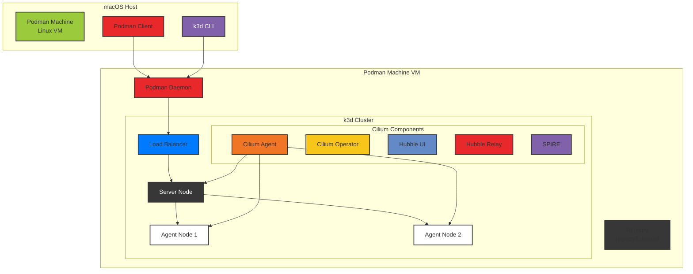

# k3d with Podman and eBPF-based CNIs (Cilium/Calico)

A comprehensive guide for running k3d (Kubernetes in Docker) clusters using Podman as the container runtime with eBPF-based CNI solutions (Cilium or Calico) for advanced networking, security, and observability features.

## Table of Contents

- [Overview](#overview)
- [Prerequisites](#prerequisites)
- [Architecture](#architecture)
- [Quick Start](#quick-start)
- [Detailed Setup Guide](#detailed-setup-guide)
- [Configuration Reference](#configuration-reference)
- [Troubleshooting](#troubleshooting)
- [Advanced Topics](#advanced-topics)

## Overview

This project demonstrates how to run k3d clusters with:

- **Podman** as the container runtime (instead of Docker)
- **eBPF-based CNIs** - Choose between Cilium or Calico for advanced networking
- **Cilium** features: Hubble observability, WireGuard encryption, SPIRE mTLS
- **Calico** features: Network policies, BGP support, flexible IPAM
- **Production-ready** configurations for both CNI options

## CNI Options

| **[Cilium](https://cilium.io/)** | **[Calico](https://www.tigera.io/project-calico/)** |
|----------------------------------|-----------------------------------------------------|
|  |  |
| eBPF-native networking, observability, and security | Cloud-native networking and network security |

### Key Features

- 🚀 Lightweight Kubernetes development environment
- 🔄 Choice of CNI: Cilium or Calico (both eBPF-based)
- 🔒 Enhanced security with encryption and network policies
- 🔍 Full observability (Hubble UI for Cilium)
- 🌐 Advanced networking with eBPF-based dataplane
- 📦 Registry integration for private images
- 🎯 Production-like development environment

## Prerequisites

### Software Requirements

| Component | Version | Purpose |
|-----------|---------|---------|
| Podman | 5.5.1+ | Container runtime |
| k3d | v5.8.3+ | Kubernetes cluster management |
| k3s | v1.31.5+ | Lightweight Kubernetes |
| kubectl | Latest | Kubernetes CLI |
| Helm | 3.x | Package management |
| Cilium CLI | Latest | Cilium management |
| calicoctl | v3.30.3+ | Calico management (optional) |

### System Requirements

- **OS**: macOS (Intel/Apple Silicon) or Linux
- **Memory**: 16GB RAM recommended
- **CPU**: 4+ cores recommended
- **Disk**: 50GB+ available space
- **Kernel**: Linux kernel 5.4+ (for Cilium)

## Architecture



## Quick Start

```bash
# 1. Clone the repository
git clone https://github.com/mkm29/k3d-cilium
cd k3d-podman

# 2. Initialize Podman machine (macOS only)
podman machine init --cpus 16 --memory 16384 --disk-size 100

# 3. Configure SSH (required for k3d)
cat >> ~/.ssh/config <<EOF
Host localhost 127.0.0.1
    IdentityFile ~/.local/share/containers/podman/machine/machine
    StrictHostKeyChecking no
EOF

# 4a. Create cluster with Cilium (default)
make create-cluster
make patch-nodes
make install-prometheus-crds
make install-cilium

# 4b. OR create cluster with Calico
make create-cluster K3D_CONFIG=k3d-calico-config.yaml
make install-calico

# 5. Verify installation
# For Cilium:
cilium status --wait
# For Calico:
kubectl get pods -n calico-system
```

## Detailed Setup Guide

### Step 1: Podman Installation and Configuration

#### macOS Setup

```bash
# Install Podman
brew install podman

# Initialize Podman machine with adequate resources
podman machine init podman-machine-default \
    --cpus 16 \
    --memory 16384 \
    --disk-size 100 \
    --now

# Install system helper for Docker API compatibility
sudo /opt/homebrew/Cellar/podman/5.5.1/bin/podman-mac-helper install
podman machine stop
podman machine start

# Configure cgroup delegation (required for k3d)
podman machine ssh bash -e <<EOF
  printf '[Service]\nDelegate=cpuset\n' | sudo tee /etc/systemd/system/user@.service.d/k3d.conf
  sudo systemctl daemon-reload
  sudo systemctl restart "user@\${UID}"
EOF
```

#### Linux Setup

```bash
# Install Podman (Ubuntu/Debian)
sudo apt-get update
sudo apt-get install -y podman

# Enable Podman socket
sudo systemctl enable --now podman.socket

# For rootless mode
systemctl --user enable --now podman.socket
```

### Step 2: Environment Configuration

```bash
# Get connection details
podman system connection ls

# Set environment variables (adjust port based on output above)
export DOCKER_HOST=ssh://core@localhost:58102
export DOCKER_SOCKET=/run/user/501/podman/podman.sock

# Create custom network (required for DNS)
podman network create k3d-podman

# Create registry (optional, for private images)
k3d registry create --default-network k3d-podman uds
```

### Step 3: SSH Configuration

Update `~/.ssh/config`:

```ssh
Host localhost
    IdentityFile ~/.local/share/containers/podman/machine/machine
    StrictHostKeyChecking no

Host 127.0.0.1
    IdentityFile ~/.local/share/containers/podman/machine/machine
    StrictHostKeyChecking no
```

### Step 4: Cluster Creation

#### Option A: Cilium CNI

Using the Makefile:

```bash
# Run preflight checks
make preflight

# Create cluster with Cilium config (default)
make create-cluster
# OR explicitly specify config
make create-cluster K3D_CONFIG=k3d-cilium-config.yaml

# Patch nodes for BPF/cgroup support
make patch-nodes

# Install Prometheus CRDs (for ServiceMonitor support)
make install-prometheus-crds

# Install Cilium
make install-cilium
```

#### Option B: Calico CNI

Using the Makefile:

```bash
# Run preflight checks
make preflight

# Create cluster with Calico config
make create-cluster K3D_CONFIG=k3d-calico-config.yaml

# Install Calico
make install-calico
```

#### Custom Configuration

You can use any k3d configuration file:

```bash
# Use custom config and cluster name
make create-cluster CLUSTER_NAME=my-cluster K3D_CONFIG=my-custom-config.yaml
```

### Step 5: Verification

#### For Cilium:

```bash
# Check Cilium status
cilium status --wait

# Run connectivity tests
cilium connectivity test

# Access Hubble UI
cilium hubble ui

# Check cluster nodes
kubectl get nodes

# Verify Cilium pods
kubectl get pods -n kube-system | grep cilium
```

#### For Calico:

```bash
# Check Calico pods
kubectl get pods -n calico-system
kubectl get pods -n tigera-operator

# Check nodes
kubectl get nodes -o wide

# Verify Calico is running
kubectl get felixconfiguration -o yaml

# Check IP pools
kubectl get ippools -o wide

# Check node status with calicoctl (if installed)
kubectl exec -n calico-system calico-node-xxxxx -- calicoctl node status
```

### Step 6: Installing calicoctl (Optional for Calico)

The `calicoctl` command line tool provides additional management capabilities for Calico:

```bash
# macOS
curl -L https://github.com/projectcalico/calico/releases/download/v3.30.3/calicoctl-darwin-amd64 -o calicoctl
chmod +x calicoctl
sudo mv calicoctl /usr/local/bin/

# Linux
curl -L https://github.com/projectcalico/calico/releases/download/v3.30.3/calicoctl-linux-amd64 -o calicoctl
chmod +x calicoctl
sudo mv calicoctl /usr/local/bin/

# Configure calicoctl
export DATASTORE_TYPE=kubernetes
export KUBECONFIG=~/.kube/config

# Verify installation
calicoctl version
```

## Configuration Reference

### Makefile Targets

| Target | Description | Dependencies | Variables |
|--------|-------------|--------------|-----------|
| `help` | Show available commands | - | - |
| `preflight` | Check required tools | - | - |
| `create-cluster` | Create k3d cluster | preflight | `K3D_CONFIG`, `CLUSTER_NAME` |
| `patch-nodes` | Configure BPF mounts (Cilium) | create-cluster | - |
| `install-prometheus-crds` | Install Prometheus CRDs | - | - |
| `install-gateway-api` | Install Gateway API CRDs | - | - |
| `install-cilium` | Install Cilium CNI | patch-nodes | - |
| `uninstall-cilium` | Remove Cilium | - | - |
| `install-calico` | Install Calico CNI | create-cluster | - |
| `uninstall-calico` | Remove Calico | - | - |
| `delete-cluster` | Delete k3d cluster | - | `CLUSTER_NAME` |
| `create-calico-cluster` | Create Calico cluster | preflight | `CALICO_CLUSTER_NAME` |
| `delete-calico-cluster` | Delete Calico cluster | - | `CALICO_CLUSTER_NAME` |

### k3d Configuration

#### Cilium Configuration (`k3d-cilium-config.yaml`)

```yaml
apiVersion: k3d.io/v1alpha5
kind: Simple
metadata:
  name: uds
servers: 1                      # Control plane nodes
agents: 2                       # Worker nodes
image: rancher/k3s:v1.33.1-k3s1 # k3s version
subnet: "172.28.0.0/16"         # Cluster subnet
ports:
  - port: 8080:80               # Expose port 80 as 8080
    nodeFilters:
      - loadbalancer
options:
  k3s:
    extraArgs:
      # Disable default CNI for Cilium
      - arg: --disable-network-policy
        nodeFilters:
          - server:*
      - arg: --flannel-backend=none
        nodeFilters:
          - server:*
      - arg: --disable=traefik
        nodeFilters:
          - server:*
registries:
  mirrors:
    registry1.dso.mil:
      endpoint:
        - http://registry1.dso.mil
  configs:
    registry1.dso.mil:
      auth:
        username: <username>
        password: <password>
```

#### Calico Configuration (`calico-k3d-config.yaml`)

```yaml
apiVersion: k3d.io/v1alpha5
kind: Simple
metadata:
  name: calico
servers: 1                      # Control plane nodes
agents: 2                       # Worker nodes
image: rancher/k3s:v1.33.1-k3s1 # k3s version
subnet: "172.28.0.0/16"         # Cluster subnet
ports:
  - port: 8080:80               # Expose port 80 as 8080
    nodeFilters:
      - loadbalancer
  - port: 6443:6443             # API server port
    nodeFilters:
      - loadbalancer
options:
  k3s:
    extraArgs:
      # Disable default CNI for Calico
      - arg: --flannel-backend=none
        nodeFilters:
          - server:*
      - arg: --disable-network-policy
        nodeFilters:
          - server:*
      # Calico specific settings
      - arg: --cluster-cidr=192.168.0.0/16
        nodeFilters:
          - server:*
      - arg: --service-cidr=10.96.0.0/12
        nodeFilters:
          - server:*
      - arg: --disable=traefik
        nodeFilters:
          - server:*
```

### Cilium Values (`cilium-values.yml`)

```yaml
# BPF Configuration
bpf:
  masquerade: true              # Enable BPF masquerading

# Cluster Identity
cluster:
  name: k3d-uds
  id: 99                        # Unique cluster ID

# Networking
kubeProxyReplacement: true      # Replace kube-proxy with eBPF

# Observability
hubble:
  enabled: true
  metrics:
    enabled:
      - dns:query;ignoreAAAA
      - drop
      - tcp
      - flow
      - icmp
      - http
    dashboards:
      enabled: true
    serviceMonitor:
      enabled: true  # Requires Prometheus CRDs
  relay:
    enabled: true
  ui:
    enabled: true

# Ingress
ingressController:
  enabled: true
  default: true

# Security
authentication:
  mutual:
    spire:
      enabled: true
      install:
        enabled: true

# Encryption
encryption:
  enabled: true
  type: wireguard
  nodeEncryption: true
```

### Calico Configuration

The default Calico installation provides:

- **IPAM**: Calico's IP Address Management
- **Network Policy**: Full Kubernetes NetworkPolicy support plus Calico-specific policies
- **Data Store**: Kubernetes API server (no etcd required)
- **Default CIDR**: 192.168.0.0/16 for pod networking
- **Service CIDR**: 10.96.0.0/12 for Kubernetes services
- **BGP**: Optional BGP routing for advanced networking scenarios
- **Multiple Dataplane Options**:
  - **Standard (iptables)**: Default Linux dataplane using iptables/ipsets
  - **eBPF**: High-performance dataplane using eBPF programs
  - **VPP**: Vector Packet Processing for extreme performance (experimental)

## Troubleshooting

### Common Issues

#### 1. Podman Connection Issues

**Problem**: k3d cannot connect to Podman

```bash
Error: Cannot connect to the Docker daemon
```

**Solution**:

```bash
# Verify Podman is running
podman machine list
podman machine start

# Check environment variables
echo $DOCKER_HOST
echo $DOCKER_SOCKET

# Test connection
docker version
```

#### 2. BPF Mount Failures

**Problem**: BPF filesystem not mounting

```bash
Error: failed to mount BPF filesystem
```

**Solution**:

```bash
# Verify mounts on nodes
for node in $(kubectl get nodes -o jsonpath='{.items[*].metadata.name}'); do
    echo "=== Node: $node ==="
    docker exec $node mount | grep bpf
    docker exec $node mount | grep cgroup
done

# Remount if needed
make patch-nodes
```

#### 3. Cilium Installation Failures

**Problem**: Cilium pods not starting

```bash
cilium-agent CrashLoopBackOff
```

**Solution**:

```bash
# Check logs
kubectl logs -n kube-system -l app.kubernetes.io/name=cilium-agent

# Verify kernel requirements
kubectl exec -n kube-system ds/cilium -- cilium-health status

# Reinstall with debug
cilium uninstall
cilium install -f cilium-values.yml --debug
```

#### 4. DNS Resolution Issues

**Problem**: Pods cannot resolve DNS

```bash
nslookup: can't resolve 'kubernetes.default'
```

**Solution**:

```bash
# Check CoreDNS
kubectl get pods -n kube-system -l k8s-app=kube-dns

# For Cilium - Verify DNS proxy
kubectl exec -n kube-system ds/cilium -- cilium config view | grep dns

# For Calico - Check DNS configuration
kubectl get endpoints -n kube-system kube-dns

# Test DNS
kubectl run test-dns --image=busybox:1.28 --rm -it -- nslookup kubernetes.default
```

#### 5. Calico-Specific Issues

**Problem**: Calico pods stuck in Init or CrashLoopBackOff

```bash
Error: calico-node pods not ready
```

**Solution**:

```bash
# Check logs
kubectl logs -n calico-system -l k8s-app=calico-node

# Verify operator logs
kubectl logs -n tigera-operator deployment/tigera-operator

# Check node configuration
kubectl get nodes -o yaml | grep -A5 "podCIDR"
```

**Problem**: Pods cannot communicate across nodes (Calico)

```bash
# Test connectivity
kubectl run test-pod --image=busybox --rm -it -- sh
/ # ping <pod-ip-on-different-node>
```

**Solution**:

```bash
# Check Calico node status
kubectl get pods -n calico-system -o wide

# Verify BGP peers (if using BGP)
kubectl exec -n calico-system calico-node-xxxxx -- calicoctl node status

# Check IP pools
kubectl get ippools -o yaml

# Verify IPIP tunnel status
kubectl exec -n calico-system ds/calico-node -- ip tunnel show

# Check routing table
kubectl exec -n calico-system ds/calico-node -- ip route

# Verify iptables rules
kubectl exec -n calico-system ds/calico-node -- iptables-save | grep -i calico
```

**Problem**: Calico eBPF mode issues

```bash
Error: BPF dataplane not working correctly
```

**Solution**:

```bash
# Verify eBPF is enabled
kubectl get felixconfiguration default -o yaml | grep bpfEnabled

# Check BPF maps
kubectl exec -n calico-system ds/calico-node -- bpftool map list

# Verify BPF programs are loaded
kubectl exec -n calico-system ds/calico-node -- bpftool prog list

# Check for BPF-related errors
kubectl logs -n calico-system -l k8s-app=calico-node | grep -i bpf

# Ensure kernel has BPF support
kubectl exec -n calico-system ds/calico-node -- grep CONFIG_BPF /boot/config-$(uname -r)
```

### Debug Commands

```bash
# Cluster status
k3d cluster list
kubectl cluster-info

# Node status
kubectl get nodes -o wide
kubectl describe nodes

# Cilium status
cilium status
cilium config view
kubectl -n kube-system exec ds/cilium -- cilium monitor

# Hubble status
hubble status
hubble observe

# Cilium network policies
kubectl get cnp -A
kubectl get ccnp

# Calico status
kubectl get pods -n calico-system
kubectl get pods -n tigera-operator

# Calico specific resources
kubectl get felixconfigurations
kubectl get ippools
kubectl get ipamblocks
kubectl get networkpolicies -A

# Calico network policies
kubectl get networkpolicies.projectcalico.org -A
kubectl get globalnetworkpolicies

# Using calicoctl from inside a pod (if calicoctl not installed locally)
kubectl exec -n calico-system deployment/calico-kube-controllers -- calicoctl get nodes
kubectl exec -n calico-system deployment/calico-kube-controllers -- calicoctl get ippools
kubectl exec -n calico-system deployment/calico-kube-controllers -- calicoctl get workloadendpoints

# Check Calico node connectivity
kubectl exec -n calico-system ds/calico-node -- calicoctl node status
kubectl exec -n calico-system ds/calico-node -- calicoctl get bgppeers

# Debug Calico dataplane
kubectl exec -n calico-system ds/calico-node -- calico-node -felix-live -felix-ready

# View Calico logs
kubectl logs -n calico-system -l k8s-app=calico-node --tail=100
kubectl logs -n tigera-operator deployment/tigera-operator --tail=100
```

## Understanding eBPF

<p align="center">
  
</p>

### What is eBPF?

[eBPF (extended Berkeley Packet Filter)](https://ebpf.io/) is a revolutionary technology that enables programmable kernel-level functionality without modifying kernel source code or loading kernel modules. Both Cilium and Calico leverage eBPF to provide high-performance, secure networking.

### Key Benefits of eBPF

- **Performance**: Run networking logic in kernel space for minimal overhead
- **Security**: Implement fine-grained security policies at the kernel level
- **Observability**: Deep visibility into network traffic and system behavior
- **Flexibility**: Dynamically update networking behavior without restarts

### How CNIs Use eBPF

#### Cilium

- **Native eBPF**: Built from the ground up on eBPF
- **kube-proxy replacement**: Full eBPF-based load balancing
- **Network policies**: Enforced in kernel with eBPF programs
- **Visibility**: Hubble leverages eBPF for deep observability

#### Calico

- **eBPF dataplane**: Optional high-performance mode
- **XDP support**: eXpress Data Path for fast packet processing
- **Policy enforcement**: eBPF programs for efficient rule matching
- **Hybrid mode**: Can run with or without eBPF

### Learn More

- [eBPF Official Website](https://ebpf.io/)
- [eBPF Summit Videos](https://ebpf.io/summit-2024/)
- [Cilium eBPF Documentation](https://docs.cilium.io/en/stable/bpf/)
- [Calico eBPF Documentation](https://docs.tigera.io/calico/latest/operations/ebpf/)

## Advanced Topics

### Custom Network Policies

#### Cilium Network Policy

```yaml
apiVersion: cilium.io/v2
kind: CiliumNetworkPolicy
metadata:
  name: allow-frontend-to-backend
spec:
  endpointSelector:
    matchLabels:
      app: backend
  ingress:
    - fromEndpoints:
        - matchLabels:
            app: frontend
      toPorts:
        - ports:
            - port: "8080"
              protocol: TCP
```

#### Calico Network Policy

```yaml
apiVersion: projectcalico.org/v3
kind: NetworkPolicy
metadata:
  name: allow-nginx-ingress
  namespace: default
spec:
  selector: app == "nginx"
  types:
  - Ingress
  ingress:
  - action: Allow
    protocol: TCP
    source:
      selector: app == "client"
    destination:
      ports:
      - 80
```

#### Calico Global Network Policy

Global policies apply across all namespaces:

```yaml
apiVersion: projectcalico.org/v3
kind: GlobalNetworkPolicy
metadata:
  name: deny-egress-to-private
spec:
  selector: all()
  types:
  - Egress
  egress:
  - action: Deny
    protocol: TCP
    destination:
      nets:
      - 10.0.0.0/8
      - 172.16.0.0/12
      - 192.168.0.0/16
  - action: Allow  # Allow everything else
```

### Enabling Additional Features

#### Gateway API Support

```bash
cilium install --set gatewayAPI.enabled=true
```

#### Service Mesh (Beta)

```bash
cilium install --set serviceProxy.enabled=true
```

#### BGP Control Plane

```bash
cilium install --set bgpControlPlane.enabled=true
```

### Performance Tuning

#### Cilium Performance Settings

```yaml
# High-performance settings
cilium:
  config:
    bpf-map-dynamic-size-ratio: "0.005"
    bpf-policy-map-max: "65536"
    bpf-lb-map-max: "65536"
    preallocate-bpf-maps: "true"
```

#### Calico Performance Tuning

```bash
# Adjust Felix configuration
kubectl patch felixconfiguration default --type='merge' -p '{"spec":{"prometheusMetricsEnabled":true}}'

# Enable fast datapath (eBPF)
kubectl patch felixconfiguration default --type='merge' -p '{"spec":{"bpfEnabled":true}}'

# Advanced Felix tuning for high-performance environments
cat <<EOF | kubectl apply -f -
apiVersion: projectcalico.org/v3
kind: FelixConfiguration
metadata:
  name: default
spec:
  bpfEnabled: true
  bpfDataIfacePattern: "^(eth|ens|enp|wl)"
  bpfLogLevel: "Info"
  floatingIPs: Enabled
  logSeverityScreen: Info
  prometheusMetricsEnabled: true
  prometheusMetricsPort: 9091
  ipipEnabled: true
  vxlanEnabled: false
  wireguardEnabled: false
  failsafeInboundHostPorts:
  - protocol: tcp
    port: 22
  - protocol: tcp
    port: 443
  - protocol: tcp
    port: 6443
  failsafeOutboundHostPorts:
  - protocol: tcp
    port: 443
  - protocol: udp
    port: 53
  - protocol: tcp
    port: 53
EOF

# Configure Calico for high connection environments
kubectl patch felixconfiguration default --type='merge' -p '{
  "spec": {
    "conntrackMaxPerCore": 131072,
    "natPortRange": "32768:65535",
    "natOutgoingInterfaceFilter": "eth0"
  }
}'

# Enable BPF connection-time load balancing
kubectl patch felixconfiguration default --type='merge' -p '{
  "spec": {
    "bpfConnectTimeLoadBalancingEnabled": true,
    "bpfExternalServiceMode": "DSR"
  }
}'
```

#### Switching Calico Dataplane Modes

Switch between different Calico dataplane modes:

```bash
# Switch to eBPF dataplane (requires kernel 5.3+)
kubectl patch felixconfiguration default --type='merge' -p '{"spec":{"bpfEnabled":true}}'

# Verify eBPF mode is active
kubectl logs -n calico-system -l k8s-app=calico-node | grep -i "BPF dataplane is in use"

# Switch back to standard iptables dataplane
kubectl patch felixconfiguration default --type='merge' -p '{"spec":{"bpfEnabled":false}}'

# Configure eBPF with specific settings
cat <<EOF | kubectl apply -f -
apiVersion: projectcalico.org/v3
kind: FelixConfiguration
metadata:
  name: default
spec:
  bpfEnabled: true
  bpfKubeProxyIptablesCleanupEnabled: true
  bpfKubeProxyMinSyncPeriod: 1s
  bpfExtToServiceConnmark: 0x80000000
  bpfDataIfacePattern: "^(eth|ens|enp|wl)"
  bpfLogLevel: "Info"
EOF
```

### Calico-Specific Advanced Features

#### BGP Configuration

Enable BGP for advanced routing scenarios:

```yaml
apiVersion: projectcalico.org/v3
kind: BGPConfiguration
metadata:
  name: default
spec:
  logSeverityScreen: Info
  nodeToNodeMeshEnabled: true
  asNumber: 64512
  serviceClusterIPs:
  - cidr: 10.96.0.0/12
  serviceExternalIPs:
  - cidr: 10.100.0.0/16
```

Configure BGP peers:

```yaml
apiVersion: projectcalico.org/v3
kind: BGPPeer
metadata:
  name: external-router
spec:
  peerIP: 172.16.1.1
  asNumber: 64513
  nodeSelector: "!all()"  # Apply to specific nodes
```

Per-node BGP configuration:

```yaml
apiVersion: projectcalico.org/v3
kind: Node
metadata:
  name: k3d-calico-server-0
spec:
  bgp:
    ipv4Address: 172.28.0.2/16
    ipv4IPIPTunnelAddr: 192.168.255.1
```

#### IP Pool Management

Create custom IP pools for different workloads:

```yaml
apiVersion: projectcalico.org/v3
kind: IPPool
metadata:
  name: production-pool
spec:
  cidr: 192.168.1.0/24
  ipipMode: Never
  natOutgoing: true
  disabled: false
  nodeSelector: environment == "production"
```

Configure IPIP tunneling modes:

```yaml
apiVersion: projectcalico.org/v3
kind: IPPool
metadata:
  name: cross-subnet-pool
spec:
  cidr: 192.168.2.0/24
  ipipMode: CrossSubnet  # Options: Always, CrossSubnet, Never
  vxlanMode: Never       # Options: Always, CrossSubnet, Never
  natOutgoing: true
  disabled: false
```

Example: Creating separate IP pools for different namespaces:

```bash
# Create a pool for development namespace
cat <<EOF | kubectl apply -f -
apiVersion: projectcalico.org/v3
kind: IPPool
metadata:
  name: dev-pool
spec:
  cidr: 192.168.10.0/24
  ipipMode: Never
  natOutgoing: true
  disabled: false
  nodeSelector: environment == "development"
EOF

# Create a pool with VXLAN for cloud environments
cat <<EOF | kubectl apply -f -
apiVersion: projectcalico.org/v3
kind: IPPool
metadata:
  name: cloud-pool
spec:
  cidr: 192.168.20.0/24
  ipipMode: Never
  vxlanMode: Always
  natOutgoing: true
  disabled: false
EOF

# Annotate namespace to use specific pool
kubectl annotate namespace development projectcalico.org/ipv4pools='["dev-pool"]'
kubectl annotate namespace cloud projectcalico.org/ipv4pools='["cloud-pool"]'
```

#### Calico Workload Endpoints

View and manage workload endpoints:

```bash
# List all workload endpoints
kubectl get workloadendpoints -A

# Get detailed workload endpoint info
kubectl get workloadendpoints -o yaml

# Using calicoctl for more details
kubectl exec -n calico-system deployment/calico-kube-controllers -- calicoctl get workloadendpoints -o wide

# Filter workload endpoints by namespace
kubectl exec -n calico-system deployment/calico-kube-controllers -- calicoctl get workloadendpoints --namespace=default
```

Create host endpoints for bare metal or VM scenarios:

```yaml
apiVersion: projectcalico.org/v3
kind: HostEndpoint
metadata:
  name: host-eth0
  labels:
    environment: production
spec:
  interfaceName: eth0
  node: k3d-calico-server-0
  expectedIPs:
  - 172.28.0.2
```

#### Calico Monitoring and Observability

Enable Prometheus metrics for Calico:

```bash
# Enable metrics in Felix
kubectl patch felixconfiguration default --type='merge' -p '{
  "spec": {
    "prometheusMetricsEnabled": true,
    "prometheusMetricsPort": 9091,
    "prometheusProcessMetricsEnabled": true
  }
}'

# Create ServiceMonitor for Prometheus Operator
cat <<EOF | kubectl apply -f -
apiVersion: monitoring.coreos.com/v1
kind: ServiceMonitor
metadata:
  name: calico-node
  namespace: calico-system
spec:
  selector:
    matchLabels:
      k8s-app: calico-node
  endpoints:
  - port: http-metrics
    interval: 30s
    path: /metrics
EOF

# Enable Typha metrics (if using Typha)
kubectl set env -n calico-system deployment/calico-typha TYPHA_PROMETHEUSMETRICSENABLED=true
kubectl set env -n calico-system deployment/calico-typha TYPHA_PROMETHEUSMETRICSPORT=9093
```

View Calico metrics:

```bash
# Port-forward to access metrics
kubectl port-forward -n calico-system ds/calico-node 9091:9091

# In another terminal, view metrics
curl http://localhost:9091/metrics | grep felix

# Key metrics to monitor:
# - felix_cluster_num_workload_endpoints
# - felix_cluster_num_hosts
# - felix_iptables_restore_calls
# - felix_ipset_calls
# - felix_route_table_list_seconds
```

### Multi-cluster Setup

```bash
# Create additional clusters
k3d cluster create cluster2 --config k3d-cluster2.yaml

# Install Cilium Cluster Mesh
cilium clustermesh enable --context k3d-cilium
cilium clustermesh enable --context k3d-cluster2
cilium clustermesh connect --context k3d-cilium --destination-context k3d-cluster2
```

## Resources

### Project Documentation

- [k3d Documentation](https://k3d.io/v5.8.3/)
- [k3s Documentation](https://docs.k3s.io/)
- [Podman Documentation](https://docs.podman.io/)

### CNI Documentation

- [Cilium Official Site](https://cilium.io/)
- [Cilium Documentation](https://docs.cilium.io/en/stable/)
- [Hubble Documentation](https://docs.cilium.io/en/stable/gettingstarted/hubble/)
- [Calico Official Site](https://www.tigera.io/project-calico/)
- [Calico Documentation](https://docs.tigera.io/calico/latest/about/)
- [Calico Network Policies](https://docs.tigera.io/calico/latest/network-policy/)
- [Calico BGP Documentation](https://docs.tigera.io/calico/latest/networking/bgp/)
- [Calico IP Pool Management](https://docs.tigera.io/calico/latest/networking/ipam/)

### eBPF Resources

- [eBPF Official Site](https://ebpf.io/)
- [eBPF Summit](https://ebpf.io/summit-2024/)

## Contributing

1. Fork the repository
2. Create a feature branch (`git checkout -b feature/amazing-feature`)
3. Commit your changes (`git commit -m 'Add amazing feature'`)
4. Push to the branch (`git push origin feature/amazing-feature`)
5. Open a Pull Request

## License

This project is licensed under the MIT License - see the LICENSE file for details.
